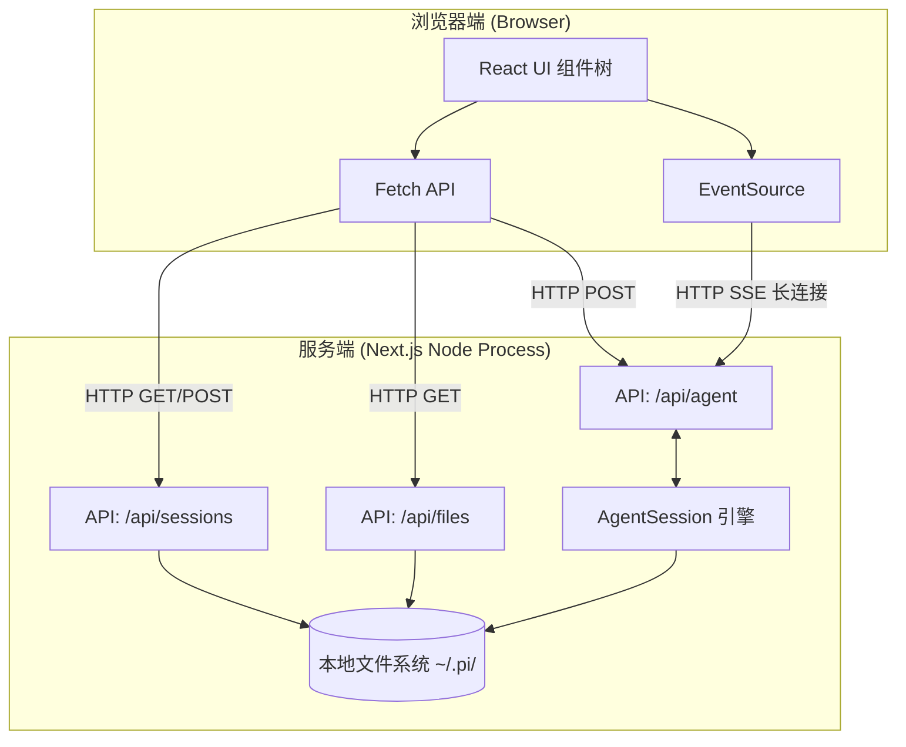
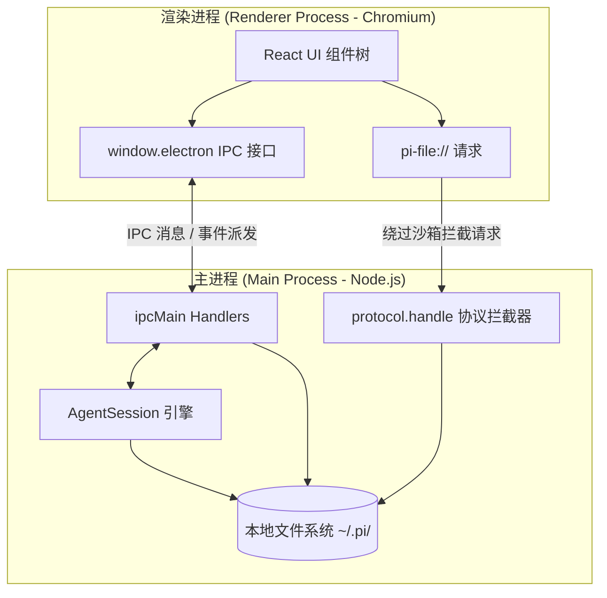

# Pi-Web 桌面端化改造技术方案

## 1. 概述
本项目旨在将当前基于 Next.js 开发的本地 Web 界面（Pi-Web）迁移为跨平台的桌面 GUI 应用程序。迁移将采用 **Electron** 架构，利用其“Node.js 后端 + Chromium 前端”的特性，无缝承接 Pi-Web 现有的本地文件读写与 Agent 进程管理能力。

## 2. 架构对比与演进

### 2.1 现有架构 (Next.js Web 服务)

在当前架构中，应用分为标准的浏览器前端和 Node.js 后端，二者通过本地环回地址 (localhost) 使用 HTTP 协议进行通信。

### 2.2 改造后目标架构 (Electron 桌面端)

在 Electron 架构中，前端运行在渲染进程（内嵌的 Chromium），后端逻辑运行在主进程（Node.js），两者同属一个桌面应用，通过 IPC（进程间通信）进行极低延迟的交互。

### 2.3 改造点与核心区别标识

对比以上两图，核心的改造点和区别如下：

| 对比维度 | 现有架构 (Next.js) | 目标架构 (Electron) | 改造动作 |
| :--- | :--- | :--- | :--- |
| **运行宿主** | 独立的浏览器应用 + 终端运行的 Node 进程 | 单一的桌面可执行程序 (.app / .exe) | 将 Next.js 静态导出，嵌入 Electron 渲染进程。 |
| **基础通信** | `fetch()` HTTP 请求 | `ipcRenderer.invoke()` IPC 调用 | **[改造重点]** 废弃 HTTP 路由，重写前端 API 客户端和后端的路由控制器。 |
| **流式通信** | `EventSource` (SSE) 单向流 | IPC Event Emitter (`ipcRenderer.on`) | **[改造重点]** 废弃 HTTP Chunked 流，改用主进程向渲染进程连续发送 IPC 事件。 |
| **获取目录列表** | `GET /api/files/*?type=list` HTTP 请求 | `ipcRenderer.invoke('list-dir')` IPC 调用 | **[改造重点]** 取消 HTTP 请求，直接在主进程读取目录并返回 JSON 数据。 |
| **文件读取** | `GET /api/files/*` 返回流 | `pi-file://*` 自定义协议拦截 | **[改造重点]** 注册 `pi-file` 特权协议，并将原 HTTP 处理逻辑直接挂载到 `protocol.handle` 上。 |
| **文件热更新** | `EventSource` 请求 `/api/files/*?type=watch` 接收 SSE 推送 | IPC 调用 `watch-file` + `ipcRenderer.on` 接收事件 | **[改造重点]** 废弃 HTTP SSE，改用主进程 `fs.watch` 结合 IPC 推送，注意组件卸载时的资源回收。 |
| **Agent 会话流** | `EventSource` 请求 `/api/agent/[id]/events` | IPC `agent-subscribe` + `ipcRenderer.on` | **[改造重点]** 移除 HTTP SSE，将打字机输出和工具调用事件直接通过 IPC 派发给前端，降低网络开销。 |
| **身份认证授权流** | `EventSource` 推送验证码 + `POST` 回传确认码 | 主进程主动派发 IPC 事件 + 前端 `invoke` 回传确认码 | **[改造重点]** 移除 `/api/auth/login` 的 SSE，在主进程的 `AuthStorage.login` 回调中直接派发事件，彻底解决网络层 Promise 挂起问题。 |
| **进程状态** | `globalThis` 内存暂存 (防 Next.js 热重载) | 主进程内存常驻 | 移除 `globalThis` hack，统一在主进程生命周期内管理 Agent 实例池。 |

---

## 3. 改造重点分析

将 Web 服务转为 Electron 桌面端，**核心在于“拆除 API 路由，搭建 IPC 桥梁”**。以下是改造的重点分布：

### 3.1 完美复用模块（几乎0改动）
*   **前端 UI 与交互**：`components/` 下所有的 React 组件树（如 `AppShell`, `SessionSidebar`, `ChatWindow`, `FileExplorer`）以及相关的状态管理。
*   **Markdown 与渲染逻辑**：前端的 KaTeX 公式渲染、代码高亮等逻辑完全兼容。
*   **CSS 与样式**：Tailwind 类名及 CSS 变量。
*   **纯业务逻辑**：Node.js 侧的 `.jsonl` 文件解析 (`lib/session-reader.ts`) 和工具字段归一化 (`lib/normalize.ts`)。

### 3.2 重点重构模块（需大量改动）
*   **通信链路 (HTTP/SSE -> IPC)**：前端不再使用 `fetch` 和 `EventSource`，必须重写为 `window.electron.invoke` 和 IPC 事件监听。
*   **后端路由 (API Routes -> Main Process)**：原 `app/api/*` 目录下的所有 Next.js 路由处理器，必须剥离并重写为 Electron 主进程中的 `ipcMain.handle` 监听器。
*   **文件系统穿透**：这是最关键的重构点。前端无法直接用 `` 加载本地绝对路径，必须通过 Electron 注册自定义协议（如 `pi-file://`）来绕过安全限制，同时复用原有的 `streamFile` 响应逻辑。
*   **生命周期管理**：摒弃为了应对 Next.js 热更新而设计的 `globalThis` hack 方案，在主进程中建立稳定的 Agent 进程池，并妥善处理应用退出的资源回收。

---

## 4. 核心模块改造策略

### 4.1 前端改造 (Renderer Process)
前端核心 UI 和状态管理几乎 100% 复用，主要修改通信层。

1.  **静态化构建**：
    *   修改 `next.config.js`，设置 `output: 'export'`，将应用打包为纯静态资源。
    *   确保所有组件不再依赖 `getServerSideProps` 或动态 API 路由渲染。
2.  **通信协议替换**：
    *   封装统一的 API 客户端。
    *   将 `fetch('/api/sessions')` 替换为 `window.electron.invoke('get-sessions')`。
    *   将 `EventSource('/api/agent/[id]/events')` 替换为 IPC 事件监听：`window.electron.on('agent-event', callback)`。

### 4.2 后端改造 (Main Process)
原 `app/api/` 下的路由逻辑需全部迁移至 Electron 的主进程。

1.  **API 路由重写为 IPC Handler**：
    *   `sessions/route.ts` $\rightarrow$ `ipcMain.handle('get-sessions', async () => { ... })`
    *   `agent/new/route.ts` $\rightarrow$ `ipcMain.handle('create-agent', async (e, payload) => { ... })`
    *   `models/route.ts` $\rightarrow$ `ipcMain.handle('get-models', async () => { ... })`
2.  **流式响应 (SSE) 改造**：
    *   主进程在处理 Agent 响应时，不再写入 HTTP Response 流，而是通过 `event.sender.send('agent-event', data)` 持续向渲染进程发送数据包。
3.  **状态与生命周期管理**：
    *   原依赖 `globalThis.__piSessions` 的 `AgentSessionWrapper` 逻辑可直接在主进程中实例化，不再需要处理 Next.js 的热重载问题。
    *   在主进程关闭（`app.on('window-all-closed')`）前，需增加钩子，优雅清理所有存活的 AgentSession。

### 4.3 本地文件访问改造 (`/api/files/[...path]`)
前端无法直接读取绝对路径，需针对文件类型分类处理：

1.  **文本与代码文件 (JSON, TS, MD 等)**：
    *   改为 IPC 调用：`ipcMain.handle('read-file', (e, path) => fs.readFileSync(path, 'utf8'))`。
2.  **媒体与文档预览 (Image, Audio, PDF, DOCX) - 自定义协议实现**：
    *   **什么是自定义协议？** 出于安全限制，Electron 的前端页面不能直接用 `` 加载本地绝对路径。为了绕过这个限制并复用已有的断点续传（Range）和流式下载能力，我们需要在主进程中注册一个专属的 URL 协议，例如 `pi-file://`。
    *   **如何做？**
        *   **步骤 1：注册权限**。在主进程启动前，使用 `protocol.registerSchemesAsPrivileged` 声明 `pi-file` 为特权协议（允许绕过 CSP、支持流媒体、支持 Fetch API）。
        *   **步骤 2：拦截与响应**。在 `app.whenReady()` 后，使用 `protocol.handle('pi-file', (request) => { ... })` 拦截所有以 `pi-file://` 开头的请求。
        *   **步骤 3：解析与复用**。从 `request.url` 中解析出真实的文件路径。然后**直接复用**你现有 Next.js 路由 (`app/api/files/[...path]/route.ts`) 中的 `createFileBodyStream`、`streamFile`、MIME 类型推断以及 `isPathAllowed` 安全校验逻辑。因为 Electron 新版的 `protocol.handle` API 恰好也要求返回一个标准的 Web `Response` 对象！
        *   **步骤 4：前端调用**。在 React 组件中，当需要预览图片或视频时，将原有的 `src="/api/files/Users/..."` 替换为 `src="pi-file:///Users/..."`。
3.  **获取文件列表 (Directory Listing)**：
    *   前端组件 `FileExplorer.tsx` 中的 `fetchEntries` 不再需要通过 `fetch(/api/files/...)` 发起 HTTP 请求。
    *   直接替换为 IPC 调用：`window.electron.invoke('list-dir', dirPath)`。
    *   主进程实现 `ipcMain.handle('list-dir', ...)` 并直接返回 `fs.readdirSync` 处理后的 JSON 数组。这种方式因为只传输纯数据（而非媒体流），无需使用 `pi-file://` 自定义协议，且比 HTTP 性能更高。
4.  **文件实时变动监听 (File Watching)**：
    *   **在 Web 架构中**：`FileViewer.tsx` 里的文本、图片、音视频、文档预览等组件，为了实现文件修改后自动刷新，使用了 `EventSource` 请求 `/api/files/[...path]?type=watch` 来接收服务端的 SSE (Server-Sent Events) 推送。
    *   **在 Desktop 架构中**：将 `EventSource` 替换为原生的 IPC 事件机制。
        *   **前端**：调用 `window.electron.invoke('watch-file', filePath)` 发起监听，并通过 `window.electron.on('file-changed', callback)` 接收变动通知。
        *   **主进程**：接收到 `watch-file` 后，调用 Node.js 的 `fs.watch(filePath)`。当文件发生变化时，通过 `event.sender.send('file-changed', { filePath, size })` 向前端推送消息。
        *   **清理**：前端组件卸载时，调用 `window.electron.invoke('unwatch-file', filePath)` 让主进程关闭对应的 `fs.watch` 实例，防止内存泄漏。

### 4.4 其他 API 模块改造 (`app/api/*`)
除了核心的文件访问，原本通过 HTTP 提供服务的其他辅助模块也需全部转换为 IPC Handler：

1.  **工作目录管理 (`/api/cwd/validate`, `/api/default-cwd`, `/api/home`)**
    *   **现状**：提供用户主目录获取、默认工作区生成、以及目录有效性校验（`statSync`）。
    *   **改造方案**：抛弃 HTTP，转换为同步或异步的 IPC 调用。
        *   `ipcMain.handle('get-home-dir', () => os.homedir())`
        *   `ipcMain.handle('create-default-cwd', () => { /* 创建并返回 ~/pi-cwd-<日期> 目录 */ })`
        *   `ipcMain.handle('validate-cwd', (e, cwd) => { /* 运行原有的 statSync 校验逻辑 */ })`
2.  **身份认证与模型提供商管理 (`/api/auth/*`)**
    *   **现状**：`/api/auth/providers` 返回提供商列表；`/api/auth/login/[provider]` 通过复杂的 **SSE 流式响应**配合前端 POST 发送 `code`，来完成 OAuth / Device Code 授权的异步双向通信。
    *   **改造方案**：
        *   **提供商列表**：简单的 `ipcMain.handle('get-auth-providers', () => { /* 调用 AuthStorage 获取列表 */ })`。
        *   **登录授权流 (SSE -> IPC 事件)**：原先通过 HTTP 流推送授权进度（如 `device_code`、`prompt_request`），现改为由主进程中的 `AuthStorage.login` 触发回调时，直接向前端发送 IPC 事件（`event.sender.send('auth-progress', data)`）。
        *   **用户交互反馈**：前端用户输入完验证码后，不再发起 `POST /api/auth/login` 请求，而是通过 `window.electron.invoke('submit-auth-code', { provider, token, code })` 将结果传回主进程，主进程获取暂存的 Promise 并 resolve，走完登录流。
        *   **登出**：`ipcMain.handle('auth-logout', (e, provider) => { /* 调用 authStorage.logout(provider) */ })`
3.  **技能与配置模块 (`/api/skills/*`, `/api/models-config`, `/api/models`)**
    *   **现状**：提供技能包查询、安装；读取 `~/.pi/agent/models.json` 配置；调用 `ModelRegistry` 获取可用大模型列表及支持的思考等级（Thinking Levels）。
    *   **改造方案**：封装为标准的 IPC Handler 即可。
        *   `ipcMain.handle('get-models', () => { /* 调用 ModelRegistry 和 SettingsManager */ })`
        *   `ipcMain.handle('get-models-config', () => readModelsJson())`
        *   `ipcMain.handle('save-models-config', (e, config) => writeModelsJson(config))`

### 4.5 Agent 与 Session 核心引擎改造 (`/api/agent/*`, `/api/sessions/*`)
这是 Pi-Web 的心脏模块。它们原本通过 HTTP 提供会话生命周期管理、状态查询以及长连接通信，在 Desktop 下需彻底变为 IPC 模式。

1.  **Agent 引擎初始化与通信 (`/api/agent/new`, `/api/agent/[id]`)**
    *   **现状**：`/api/agent/new` 通过 POST 启动新会话；`/api/agent/[id]` 接收前端命令并派发给底层的 `startRpcSession()` / `session.send()`。
    *   **改造方案**：转换为 IPC Invoke 桥接。
        *   `ipcMain.handle('agent-new', async (e, payload) => { /* 封装原有 startRpcSession 逻辑，返回 sessionId */ })`
        *   `ipcMain.handle('agent-send', async (e, id, command) => { /* 找到 session 实例，执行 session.send(command) */ })`
        *   `ipcMain.handle('agent-get-state', async (e, id) => { /* 获取 session 当前运行状态 */ })`
2.  **Agent 事件流订阅 (`/api/agent/[id]/events`)**
    *   **现状**：利用 `ReadableStream` 配合 `TextEncoder` 封装了一个 SSE (Server-Sent Events) HTTP 接口，不断向前端推送 Agent 打字/工具调用事件。
    *   **改造方案**：在 Desktop 环境下，**完全废弃 SSE**。
        *   主进程暴露监听接口：`ipcMain.handle('agent-subscribe', (e, id) => { ... })`。
        *   主进程直接挂载监听：`session.onEvent((event) => { e.sender.send('agent-event', { id, event }) })`。
        *   前端组件（如 `ChatWindow`）使用 `window.electron.on('agent-event', callback)` 实时接收打字流。
        *   **清理机制**：前端组件卸载时调用 `window.electron.invoke('agent-unsubscribe', id)` 取消监听。
3.  **Session 列表与详情 CRUD (`/api/sessions/*`)**
    *   **现状**：通过 GET / PATCH / DELETE 操作底层的 `.jsonl` 日志文件，并拼接树形上下文（Session Context）。
    *   **改造方案**：全部替换为等价的 IPC Handler。
        *   `ipcMain.handle('session-list', () => listAllSessions())`
        *   `ipcMain.handle('session-get', (e, id, includeState) => { /* 解析 jsonl，构建 context 并返回 */ })`
        *   `ipcMain.handle('session-update', (e, id, name) => { /* 修改 jsonl 头部 */ })`
        *   `ipcMain.handle('session-delete', (e, id) => { /* 销毁 Agent，处理级联重定向(cascade re-parent)，删除文件 */ })`

---

## 5. 实施步骤与里程碑

### Phase 1: 基础设施搭建 (1-2 Days)
*   在项目中引入 Electron 依赖 (`electron`, `electron-builder`)。
*   编写基础的 `main.js` (主进程入口) 和 `preload.js` (IPC 桥梁)。
*   修改 `next.config.js` 支持静态导出，并配置 Electron 加载生成的静态 `out` 目录。

### Phase 2: 核心通信层重构 (2-3 Days)
*   将 `app/api/sessions` 和 `app/api/models` 的逻辑迁移为 IPC Handlers。
*   前端实现 IPC 调用封装，确保 Session 列表、模型配置能正常加载。
*   重构 `AgentSession` 的通信机制，打通主进程到渲染进程的事件流（替换 SSE）。

### Phase 3: 文件系统与高级特性 (2-3 Days)
*   实现 `pi-file://` 自定义协议，并复用原 `route.ts` 中的安全校验（`getAllowedRoots` 等）。
*   调整 `FileExplorer` 和 `FileViewer`，确保文件树读取和媒体预览在桌面端正常工作。
*   (可选) 接入系统原生能力：系统托盘图标、全局唤醒快捷键、原生拖拽获取真实路径。

### Phase 4: 打包与分发 (1 Day)
*   配置 `electron-builder`。
*   设计应用图标，处理 macOS 签名（如有需要）。
*   产出适用于 macOS 和 Windows 的安装包。

---

## 6. 风险与注意事项
1.  **环境变量继承**：Agent 进程经常需要执行系统命令。Electron 应用从 GUI 启动时，可能无法继承终端的 `$PATH` 等环境变量（特别是 macOS）。需使用如 `fix-path` 包来确保 Agent 能正确调用 `node`, `git`, `python` 等本地工具。
2.  **安全性**：即使是本地桌面应用，也必须严格保留 `isPathAllowed` 的校验逻辑，防止前端页面中的恶意脚本（如 Agent 意外生成的恶意内容）读取系统敏感文件。
3.  **依赖兼容性**：检查如 `mammoth` (DOCX 预览) 等库在 Electron 环境下的打包兼容性，必要时配置 `electron-builder` 的 `asarUnpack`。